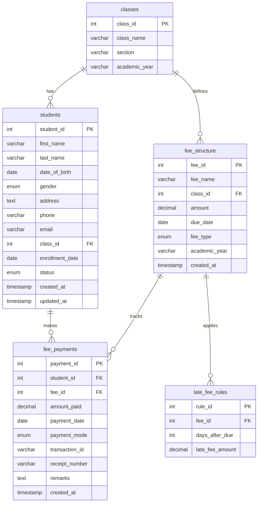

# School Fee Database System

A MySQL relational database system for managing school fees, student records, and payment tracking.

## Project Structure

```
School-Fee-DataBase-System/
│
├── database/
│   └── schema.sql       # Database schema and table definitions
│
└── README.md
```

## ER Diagram



## Database Schema

### Tables
- **classes** - Class and section management per academic year
- **students** - Student personal and enrollment details
- **fee_structure** - Fee types and amounts per class and academic year
- **fee_payments** - Payment records with transaction details
- **late_fee_rules** - Late payment penalty rules

## Getting Started

1. Run `database/schema.sql` against your MySQL server.
2. The database `school_fee_db` will be created with all tables.
3. Insert class data first, then students, fee structure, and records.
