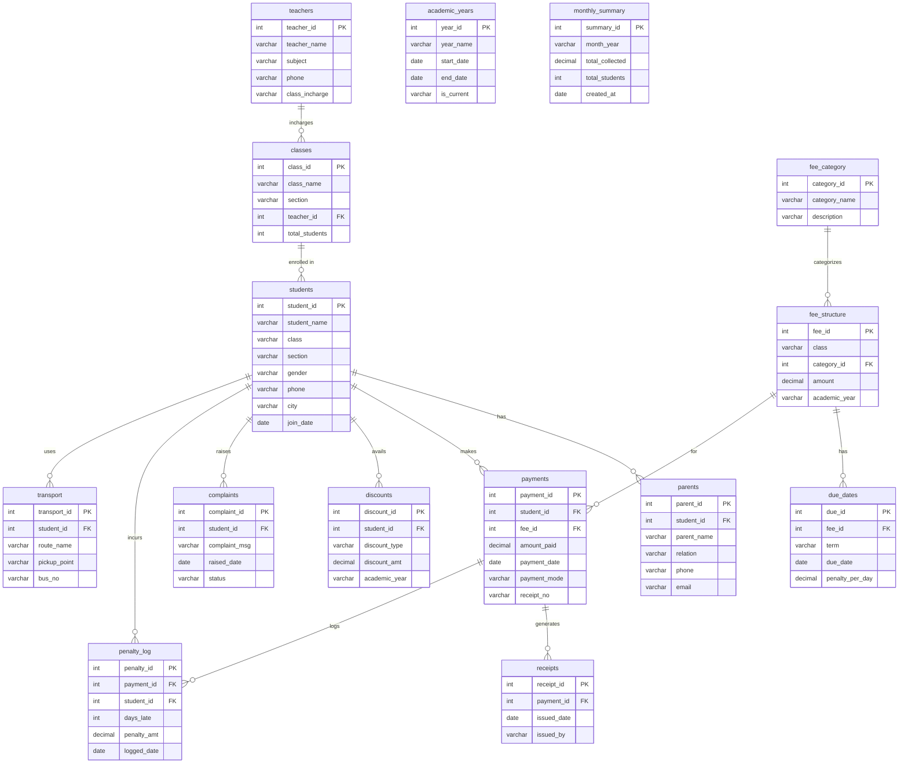

# School Fee Database System

A MySQL relational database system for managing school fees, student records, and payment tracking.

## Project Structure

```
School-Fee-DataBase-System/
│
├── database/
│   └── schema.sql       # Database schema and table definitions
│
└── README.md
```

## ER Diagram



## Tables (15)

| # | Table | Description |
|---|-------|-------------|
| 1 | academic_years | Academic year references (e.g. 2024-25) |
| 2 | teachers | Teacher details and class in-charge assignments |
| 3 | classes | Class sections with teacher assignments |
| 4 | students | Student personal and enrollment info |
| 5 | parents | Parent/guardian contact details linked to students |
| 6 | fee_category | Fee types (Tuition, Transport, Library, etc.) |
| 7 | fee_structure | Fee amounts per class and category per year |
| 8 | due_dates | Payment due dates and penalty per day per fee |
| 9 | payments | Fee payment records |
| 10 | receipts | Receipt issuance records |
| 11 | discounts | Student-specific discounts (scholarships, quotas) |
| 12 | complaints | Student fee complaints and resolution status |
| 13 | penalty_log | Late payment penalty tracking |
| 14 | monthly_summary | Aggregated monthly collection stats |
| 15 | transport | Student bus route and pickup assignments |

## Getting Started

1. Run `database/schema.sql` against your MySQL server.
2. The database `school_fee_db` will be created with all 15 tables.
3. Insert reference data first: `academic_years`, `teachers`, `fee_category`, then dependent data.
